# Previous Projects

## CodeinBlocks

---

### Description

A Visual Programming Environment built to find out if Visualization, integrated in a granular discussion of concepts, is an effective tool in teaching novice programmers.

### Environment

- HTML5
- CSS3
- Bootstrap
- Javasccript
- JQuery
- PHP
- Codeigniter
- MySql
- Apache
- Amazon Web Services

### Screenshots

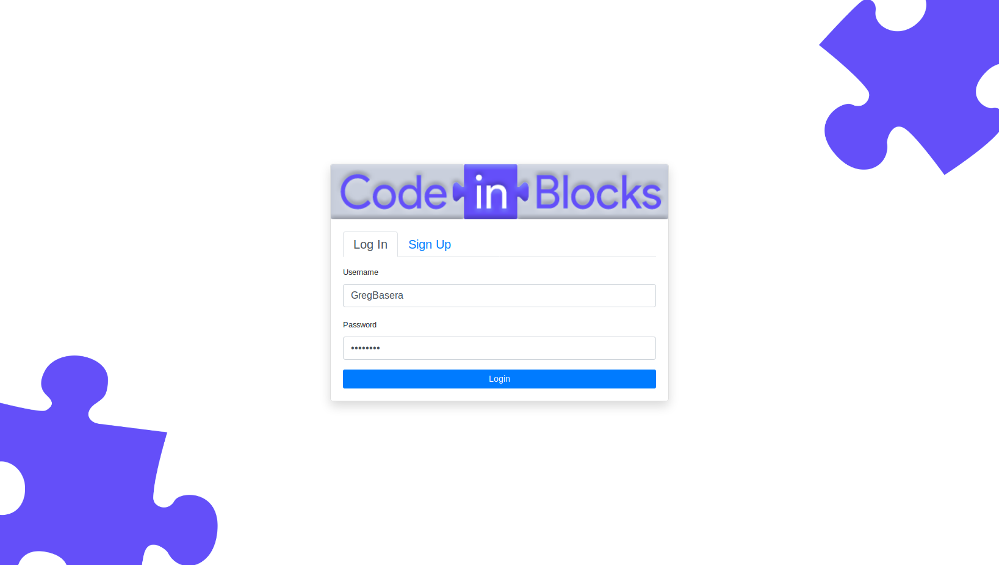

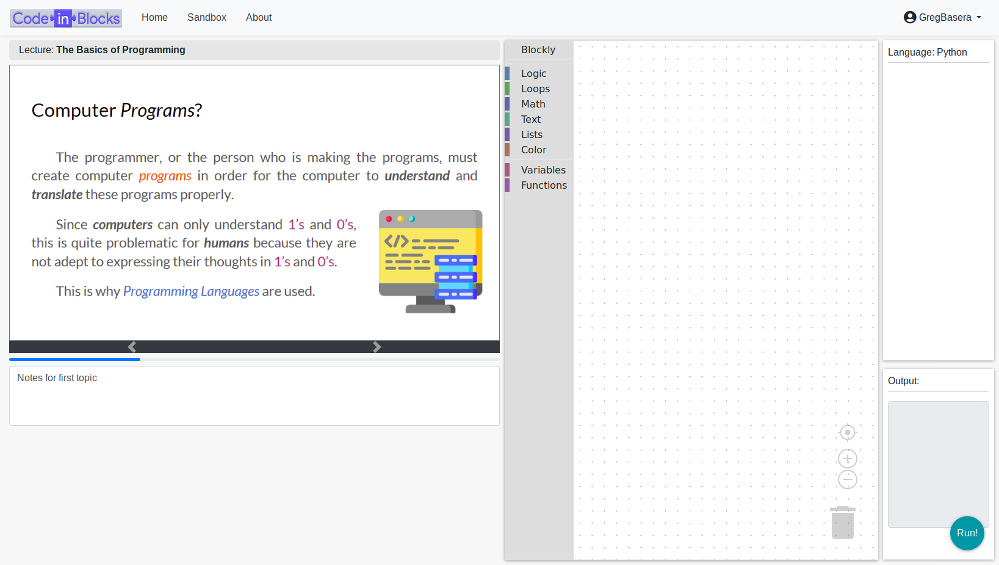

## Renty-dashboard

---

### Description

An Admin app or a CMS to manage incoming and outgoing requests, content, and variables for the Renty stack. This app is used in-tandem with Renty's client mobile app.

### Environment

- Reactjs
- MaterialUI
- Firebase

### Screenshots

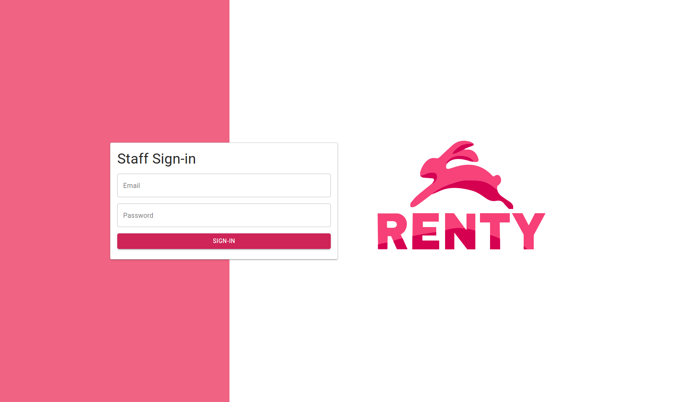

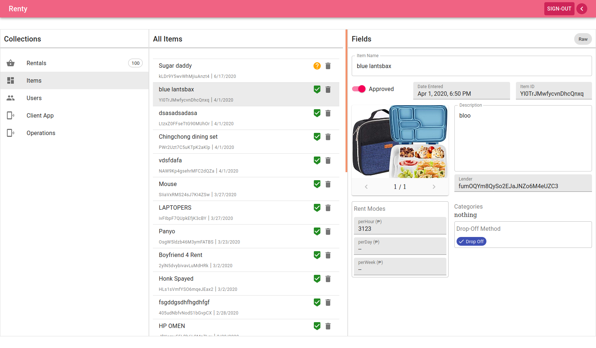

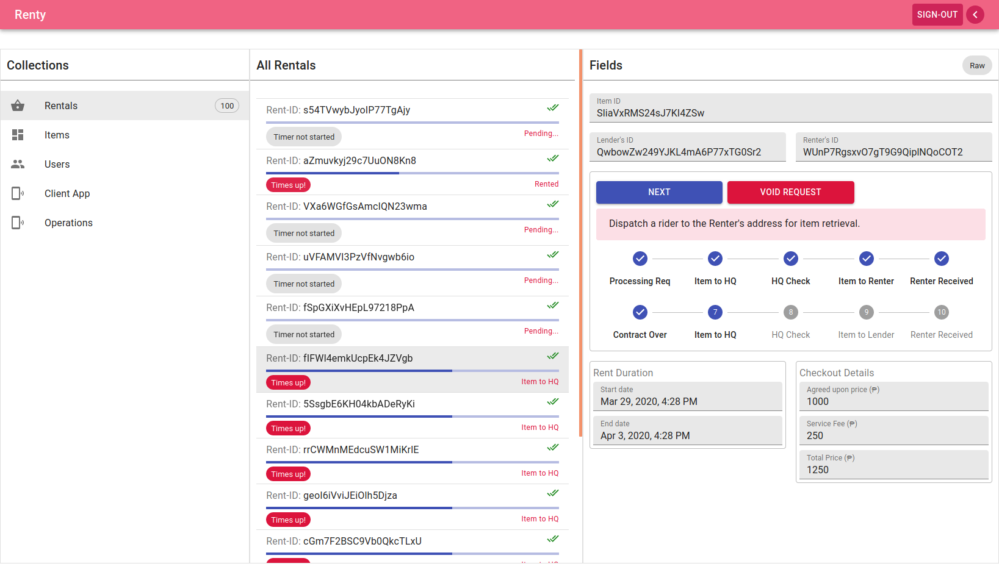

## panda-internal

---

### Description

A prototype system that aims to fill the role of being the Internal Sales Management Console for Pandalivery.

### Environment

- HTML5
- CSS3
- Bootstrap
- Javasccript
- JQuery
- PHP
- Codeigniter
- MySql
- Apache

### Screenshots

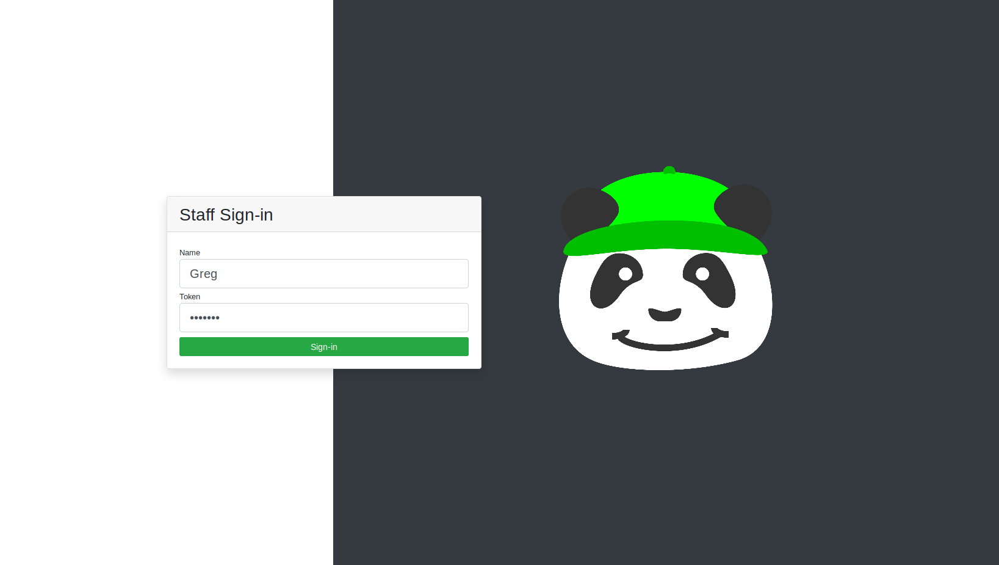

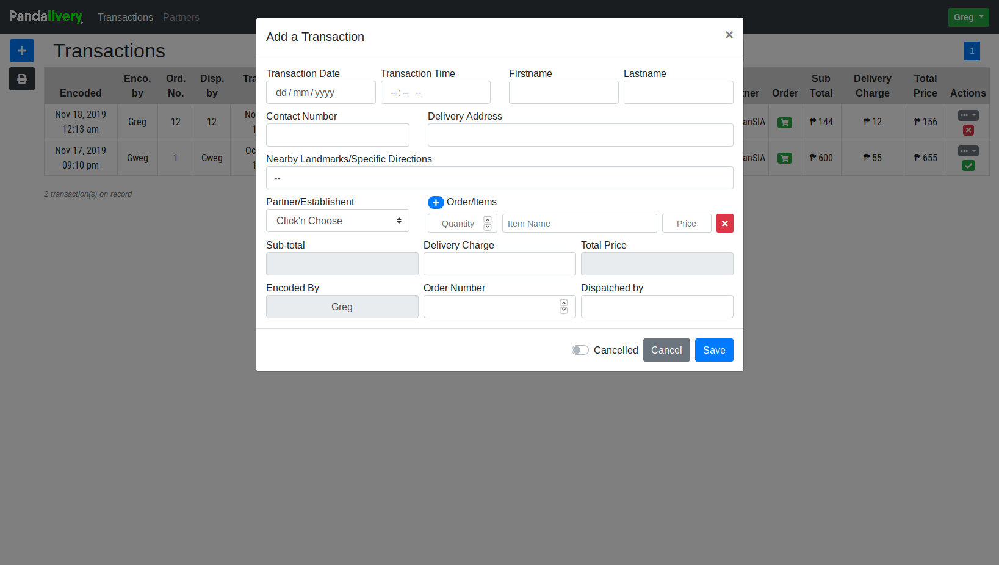

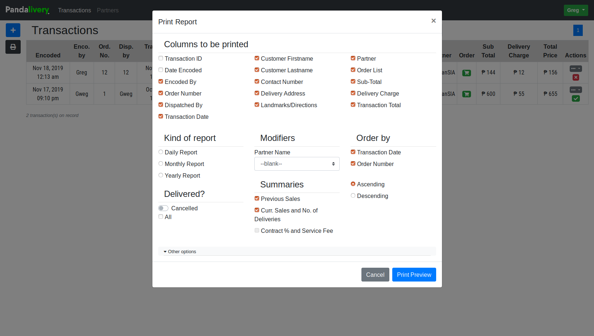

## kmsta

---

### Description

A university project intended to be an exercise of the basics of Web Development.

### Environment

- HTML5
- CSS3
- Bootstrap
- Javasccript
- JQuery
- PHP
- Codeigniter
- MySql
- Apache

### Screenshots

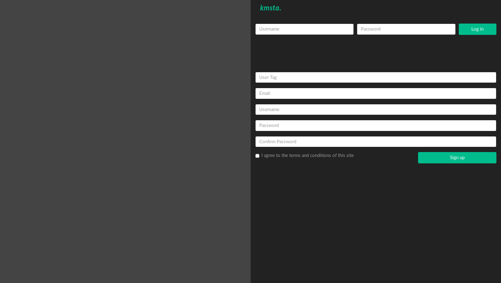

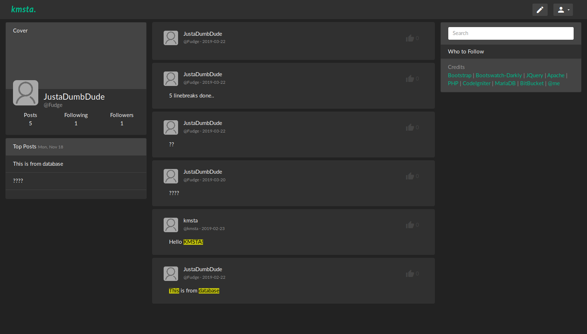

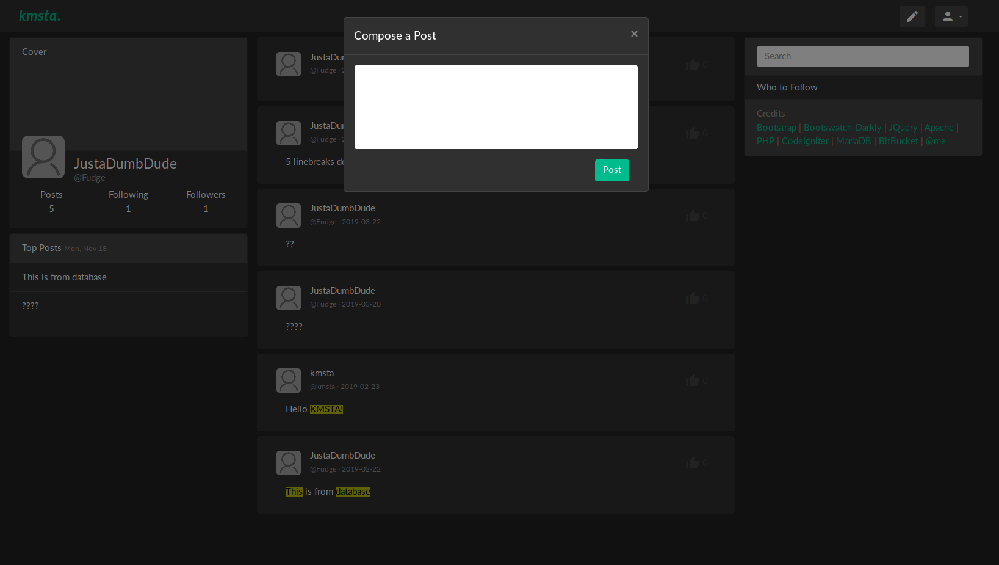

## GLAG

---

### Description

(Game of the Local Area Generals) Now you can play Game of the Generals over LAN.

### Environment

- C
- Java

### Screenshots

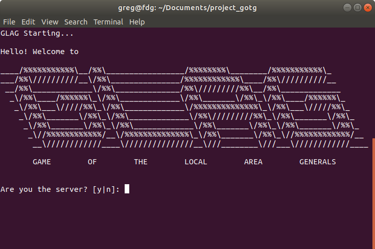

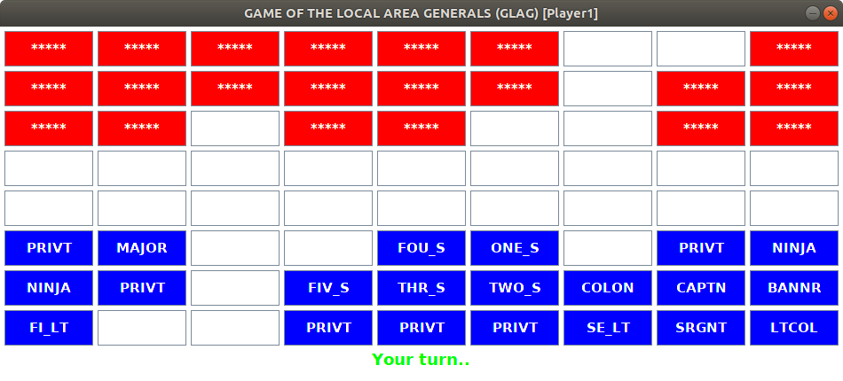

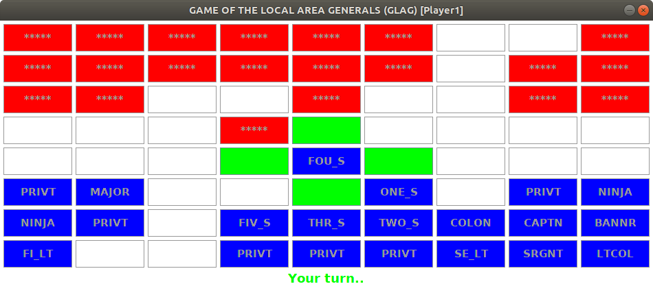

## rumble-mines

---

### Description

A multiplayer vesion of Minesweeper. There are some compromises in the gameplay, but it's quite fun.

### Environment

- Java

### Screenshots

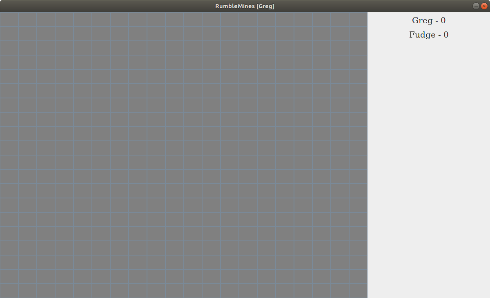

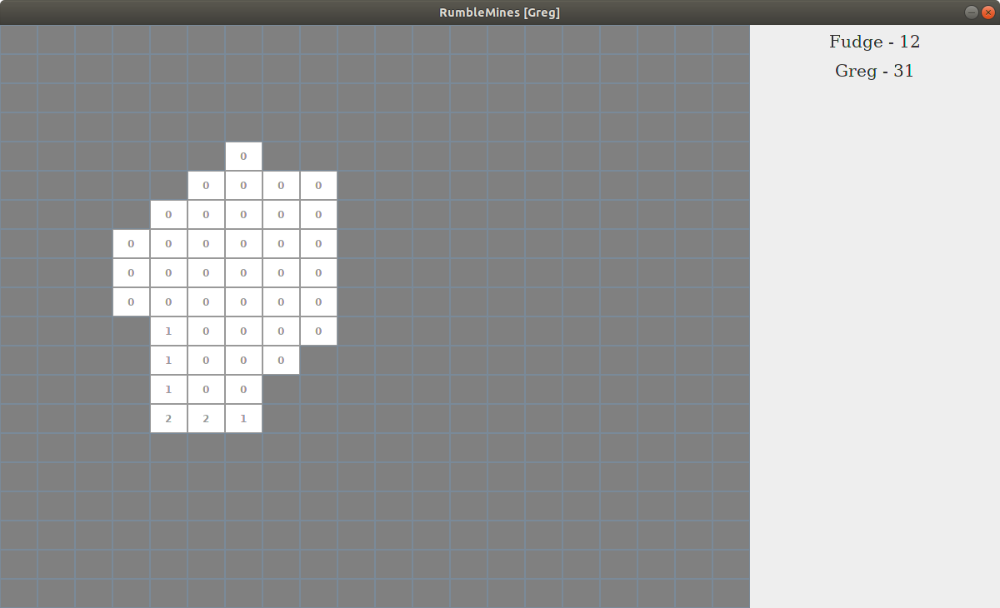
